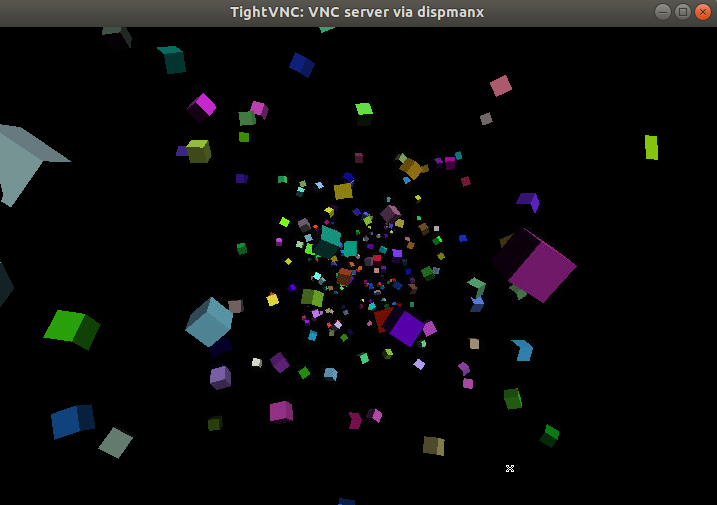

# opengles_plays

Sample OpenGLES examples for Raspberry Pi.

Download or clone and chmod +x ./makeit_*

makeit_raspi will compile for console (using libbrcmGLESv2)

makeit_xwindow will compile for xwindow (you need to enable experimetal OpenGL driver)

  
  
  
  
  
  

